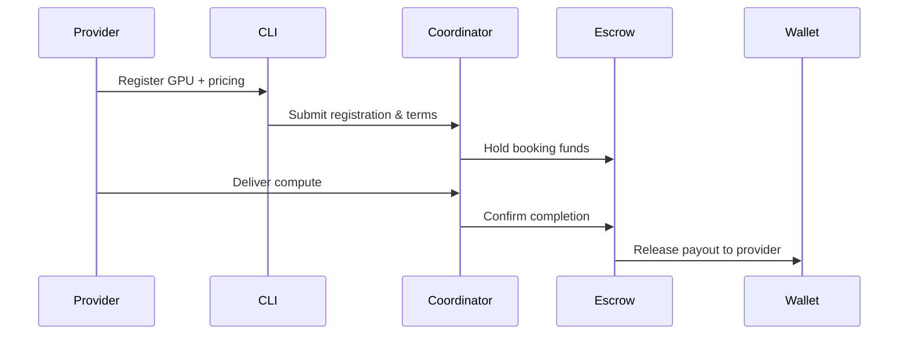

# GPU Monetization Guide

## Overview
This guide walks providers through registering GPUs, choosing pricing strategies, and understanding the payout flow for AITBC marketplace earnings.

## Prerequisites
- AITBC CLI installed locally: `pip install -e ./cli`
- Account initialized: `aitbc init`
- Network connectivity to the coordinator API
- GPU details ready (model, memory, CUDA version, base price)

## Step 1: Register Your GPU
```bash
aitbc marketplace gpu register \
  --name "My-GPU" \
  --memory 24 \
  --cuda-version 12.1 \
  --base-price 0.05
```
- Use `--region` to target a specific market (e.g., `--region us-west`).
- Verify registration: `aitbc marketplace gpu list --region us-west`.

## Step 2: Choose Pricing Strategy
- **Market Balance (default):** Stable earnings with demand-based adjustments.
- **Peak Maximizer:** Higher rates during peak hours/regions.
- **Utilization Guard:** Keeps GPU booked; lowers price when idle.
- Update pricing strategy: `aitbc marketplace gpu update --gpu-id <id> --strategy <name>`.

## Step 3: Monitor & Optimize
```bash
aitbc marketplace earnings --gpu-id <id>
aitbc marketplace status --gpu-id <id>
```
- Track utilization, bookings, and realized rates.
- Adjust `--base-price` or strategy based on demand.

## Payout Flow (Mermaid)


## Best Practices
- Start with **Market Balance**; adjust after 48h of data.
- Set `--region` to match your lowest-latency buyers.
- Update CLI regularly for the latest pricing features.
- Keep GPUs online during peak windows (local 9 AM – 9 PM) for higher fill rates.

## Troubleshooting
- No bookings? Lower `--base-price` or switch to **Utilization Guard**.
- Low earnings? Check latency/region alignment and ensure GPU is online.
- Command help: `aitbc marketplace gpu --help`.
