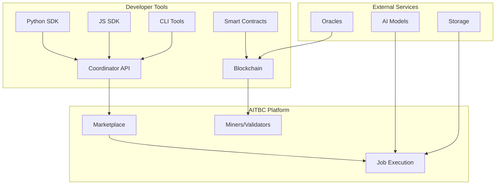

# Developer Overview

Welcome to the AITBC developer documentation! This guide will help you understand how to build applications and services on the AITBC blockchain platform.

## What You Can Build on AITBC

### AI/ML Applications
- **Inference Services**: Deploy and monetize AI models
- **Training Services**: Offer distributed model training
- **Data Processing**: Build data pipelines with verifiable computation

### DeFi Applications
- **Prediction Markets**: Create markets for AI predictions
- **Computational Derivatives**: Financial products based on AI outcomes
- **Staking Pools**: Earn rewards by providing compute resources

### NFT & Gaming
- **Generative Art**: Create AI-powered NFT generators
- **Dynamic NFTs**: NFTs that evolve based on AI computations
- **AI Gaming**: Games with AI-driven mechanics

### Infrastructure Tools
- **Oracles**: Bridge real-world data to blockchain
- **Monitoring Tools**: Track network performance
- **Development Tools**: SDKs, frameworks, and utilities

## Architecture Overview



## Key Concepts

### Jobs
Jobs are the fundamental unit of computation on AITBC. They represent AI tasks that need to be executed by miners.

### Smart Contracts
AITBC uses smart contracts for:
- Marketplace operations
- Payment processing
- Dispute resolution
- Governance

### Proofs & Receipts
All computations generate cryptographic proofs:
- **Execution Proofs**: Verify correct computation
- **Receipts**: Proof of job completion
- **Attestations**: Multiple validator signatures

### Tokens & Economics
- **AITBC Token**: Native utility token
- **Job Payments**: Pay for computation
- **Staking**: Secure the network
- **Rewards**: Earn for providing services

## Development Stack

### Core Technologies
- **Blockchain**: Custom PoS consensus
- **Smart Contracts**: Solidity-compatible
- **APIs**: RESTful with OpenAPI specs
- **WebSockets**: Real-time updates

### Languages & Frameworks
- **Python**: Primary SDK and ML support
- **JavaScript/TypeScript**: Web and Node.js support
- **Rust**: High-performance components
- **Go**: Infrastructure services

### Tools & Libraries
- **Docker**: Containerization
- **Kubernetes**: Orchestration
- **Prometheus**: Monitoring
- **Grafana**: Visualization

## Getting Started

### 1. Set Up Development Environment

```bash
# Install AITBC CLI
pip install aitbc-cli

# Initialize project
aitbc init my-project
cd my-project

# Start local development
aitbc dev start
```

### 2. Choose Your Path

#### AI/ML Developer
- Focus on model integration
- Learn about job specifications
- Understand proof generation

#### DApp Developer
- Study smart contract patterns
- Master the SDKs
- Build user interfaces

#### Infrastructure Developer
- Run a node or miner
- Build tools and utilities
- Contribute to core protocol

### 3. Build Your First Application

Choose a tutorial based on your interest:

- [AI Inference Service](./12_marketplace-extensions.md)
- [Marketplace Bot](./4_examples.md)
- [Mining Operation](../3_miners/1_quick-start.md)

## Developer Resources

### Documentation
- [API Reference](../api/)
- [SDK Guides](sdks/)
- [Examples](examples.md)
- [Best Practices](best-practices.md)

### Tools
- [AITBC CLI](tools/cli.md)
- [IDE Plugins](tools/ide-plugins.md)
- [Testing Framework](tools/testing.md)

### Community
- [Discord](https://discord.gg/aitbc)
- [GitHub Discussions](https://github.com/aitbc/discussions)
- [Stack Overflow](https://stackoverflow.com/questions/tagged/aitbc)

## Development Workflow

### 1. Local Development
```bash
# Start local testnet
aitbc dev start

# Run tests
aitbc test

# Deploy locally
aitbc deploy --local
```

### 2. Testnet Deployment
```bash
# Configure for testnet
aitbc config set network testnet

# Deploy to testnet
aitbc deploy --testnet

# Verify deployment
aitbc status
```

### 3. Production Deployment
```bash
# Configure for mainnet
aitbc config set network mainnet

# Deploy to production
aitbc deploy --mainnet

# Monitor deployment
aitbc monitor
```

## Security Considerations

### Smart Contract Security
- Follow established patterns
- Use audited libraries
- Test thoroughly
- Consider formal verification

### API Security
- Use API keys properly
- Implement rate limiting
- Validate inputs
- Use HTTPS everywhere

### Key Management
- Never commit private keys
- Use hardware wallets
- Implement multi-sig
- Regular key rotation

## Performance Optimization

### Job Optimization
- Minimize computation overhead
- Use efficient data formats
- Batch operations when possible
- Profile and benchmark

### Cost Optimization
- Optimize resource usage
- Use spot instances when possible
- Implement caching
- Monitor spending

## Contributing to AITBC

We welcome contributions! Areas where you can help:

### Core Protocol
- Consensus improvements
- New cryptographic primitives
- Performance optimizations
- Bug fixes

### Developer Tools
- SDK improvements
- New language support
- Better documentation
- Tooling enhancements

### Ecosystem
- Sample applications
- Tutorials and guides
- Community support
- Integration examples

See our [Contributing Guide](contributing.md) for details.

## Support

- 📖 [Documentation](../)
- 💬 [Discord](https://discord.gg/aitbc)
- 🐛 [Issue Tracker](https://github.com/aitbc/issues)
- 📧 [dev-support@aitbc.io](mailto:dev-support@aitbc.io)

## Next Steps

1. [Set up your environment](setup.md)
2. [Learn about authentication](api-authentication.md)
3. [Choose an SDK](sdks/)
4. [Build your first app](../../tutorials/)

Happy building! 🚀
