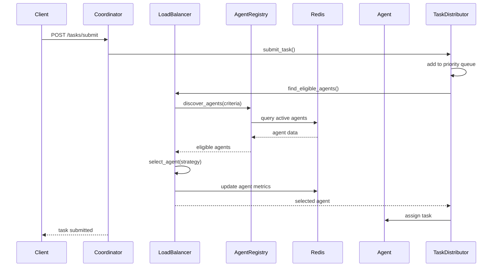

# AITBC Agent Coordinator - Architecture Documentation

> **Important:** This document describes the Agent Coordinator architecture. The Agent Coordinator service runs on port 9001. For the Coordinator API (job submission), use port 8011. For authoritative port configuration, see [Service Ports Reference](../reference/SERVICE_PORTS.md). For current operational state, see [Current Operational State](../infrastructure/CURRENT_OPERATIONAL_STATE.md).

## System Overview

The AITBC Agent Coordinator is a distributed task distribution system that manages AI agents, coordinates task assignment, and provides load balancing across multiple agent instances. The system uses Redis for persistence and FastAPI for REST API endpoints.

## Service Location

**Actual Service:** `/opt/aitbc/apps/agent-coordinator/src/app/`
**Port:** 9001
**Systemd Service:** `aitbc-agent-coordinator.service`

**DO NOT USE:** `/opt/aitbc/apps/agent-services/agent-coordinator/src/coordinator.py` (this is an older/incorrect implementation)

## Core Components

### 1. Agent Registry (`agent_discovery.py`)

The Agent Registry is the central component for managing agent lifecycle and discovery.

**Key Features:**
- Redis-backed persistence for agent data
- Agent registration and deregistration
- Agent discovery with filtering (by type, status, capabilities)
- Health score calculation based on heartbeat frequency
- Load metrics tracking (active connections, pending tasks)

**Data Model:**
- Agent data stored as Redis hashes: `agent:{agent_id}`
- Active agents indexed in Redis set: `agents:active`
- Agent status tracked: active, inactive, busy, stale

**Key Classes:**
- `AgentInfo` - Dataclass representing agent information
- `AgentRegistry` - Main registry class with Redis integration
- `AgentDiscoveryService` - Service for discovering agents with criteria

### 2. Load Balancer (`load_balancer.py`)

The Load Balancer distributes tasks across eligible agents using configurable strategies.

**Load Balancing Strategies:**
- `LEAST_CONNECTIONS` - Selects agent with fewest active connections (default)
- `ROUND_ROBIN` - Distributes tasks in circular order
- `WEIGHTED_ROUND_ROBIN` - Based on agent performance weights
- `RESOURCE_BASED` - Based on CPU/memory metrics
- `GEOGRAPHIC` - Based on agent location
- `RANDOM` - For testing purposes

**Key Classes:**
- `LoadBalancer` - Main load balancer class
- `TaskDistributor` - Manages task priority queues and distribution
- `TaskPriority` - Enum for task priorities (urgent, critical, high, normal, low)

**Task Distribution Flow:**
1. Task submitted to `TaskDistributor.submit_task()`
2. Task placed in appropriate priority queue
3. Background distribution loop processes queues
4. Load balancer finds eligible agents via `find_eligible_agents()`
5. Agent selected using configured strategy
6. Task assigned and agent metrics updated

### 3. REST API Routers

#### Agent Management (`routers/agents.py`)

**Endpoints:**
- `POST /agents/register` - Register new agent
- `POST /agents/discover` - Discover agents with filtering
- `GET /agents/{agent_id}` - Get agent information
- `PUT /agents/{agent_id}/status` - Update agent status

#### Task Management (`routers/tasks.py`)

**Endpoints:**
- `POST /tasks/submit` - Submit task for distribution
- `GET /tasks/status` - Get task distribution statistics

### 4. Agent Communication (`protocols/communication.py`)

The Agent Communication system enables agents to communicate with each other through the coordinator using various protocols.

**Message Types:**
- `DIRECT` - Point-to-point messages between specific agents
- `BROADCAST` - Messages sent to all connected agents
- `HIERARCHICAL` - Master-agent to sub-agent communication
- `PEER_TO_PEER` - Direct agent-to-agent communication
- `COORDINATION` - Coordination and synchronization messages
- `TASK_ASSIGNMENT` - Task distribution messages
- `STATUS_UPDATE` - Agent status updates
- `HEARTBEAT` - Keep-alive messages
- `DISCOVERY` - Agent discovery messages
- `CONSENSUS` - Consensus protocol messages

**Message Priorities:**
- `LOW` - Low priority messages
- `NORMAL` - Normal priority (default)
- `HIGH` - High priority messages
- `CRITICAL` - Critical priority messages

**Communication Protocols:**

**Hierarchical Protocol:**
- Master agents manage sub-agents
- Messages flow from master to sub-agents
- Sub-agents can send messages back to master
- Suitable for coordinated task execution

**Peer-to-Peer Protocol:**
- Direct agent-to-agent communication
- Agents maintain peer connections
- Messages sent directly between peers
- Suitable for decentralized coordination

**Message Structure:**
```python
AgentMessage:
  - id: Unique message ID (UUID)
  - sender_id: Sending agent ID
  - receiver_id: Target agent ID (optional for broadcast)
  - message_type: Type of message
  - priority: Message priority level
  - timestamp: Message creation time (UTC)
  - payload: Message data (dictionary)
  - correlation_id: For request-response correlation
  - reply_to: For reply messages
  - ttl: Time-to-live in seconds (default: 300)
```

**Communication Flow:**
1. Agents register with coordinator via `POST /agents/register`
2. Agents establish connections via endpoints
3. Messages routed through coordinator or direct connections
4. Message handlers process incoming messages
5. TTL ensures expired messages are discarded
6. Priority levels ensure important messages are processed first

**Current Implementation Status:**

**Implemented:**
- `POST /messages/send` - Send messages (hardcoded to "hierarchical" protocol only)
- `GET /load-balancer/stats` - Load balancer statistics
- `GET /registry/stats` - Agent registry statistics
- `GET /agents/service/{service}` - Find agents by service
- `GET /agents/capability/{capability}` - Find agents by capability
- `PUT /load-balancer/strategy` - Change load balancing strategy

**Missing / Incomplete:**
1. `POST /messages/send` only uses "hierarchical" protocol - doesn't support:
   - `peer_to_peer` protocol
   - `broadcast` protocol
   - Other protocols defined in MessageType enum
2. No broadcast endpoint - Can't send broadcast messages via API
3. No message history/storage - Messages aren't persisted
4. No peer management endpoints - Can't add/remove peers via API

**Note:** The protocols (Hierarchical, P2P, Broadcast) are well-implemented in `communication.py`, but the API layer (`messages.py`) doesn't fully expose them yet.

## Service Initialization

The service initializes in `lifespan.py` during FastAPI startup:

```python
async def lifespan(app: FastAPI):
    # Create AgentRegistry with Redis backing
    state.agent_registry = AgentRegistry()
    await state.agent_registry.start()
    
    # Create LoadBalancer with registry
    state.load_balancer = LoadBalancer(state.agent_registry)
    state.load_balancer.set_strategy(LoadBalancingStrategy.LEAST_CONNECTIONS)
    
    # Create TaskDistributor
    state.task_distributor = TaskDistributor(state.load_balancer)
    
    # Start background tasks
    asyncio.create_task(state.task_distributor.start_distribution())
    asyncio.create_task(state.message_processor.start_processing())
```

## Redis Persistence Model

### Agent Data Structure

**Hash Key:** `agent:{agent_id}`

**Fields:**
- `agent_id` - Unique identifier
- `agent_type` - Type (worker, provider, consumer, general)
- `status` - Current status (active, inactive, busy, stale)
- `capabilities` - JSON array of capabilities
- `services` - JSON array of available services
- `endpoints` - JSON object of service endpoints
- `metadata` - JSON object of additional metadata
- `last_heartbeat` - Timestamp of last heartbeat
- `registration_time` - Timestamp of registration
- `load_metrics` - JSON object of load metrics
- `health_score` - Calculated health score (0.0-1.0)
- `version` - Agent version
- `tags` - JSON array of tags

### Indexes

**Set Key:** `agents:active` - Contains IDs of all active agents

## Agent Lifecycle

### Registration
1. Agent sends POST /agents/register with agent information
2. Coordinator validates agent data
3. Agent info stored in Redis
4. Agent added to active agents set
5. Success response returned

### Heartbeat
1. Agent sends heartbeat (not yet implemented as endpoint)
2. Last heartbeat timestamp updated
3. Health score recalculated
4. Stale agents marked as inactive (configurable timeout)

### Status Update
1. Agent sends PUT /agents/{agent_id}/status
2. Status and load metrics updated
3. Load balancer uses updated metrics for task assignment

### Deregistration
1. Agent marked as inactive
2. Removed from active agents set
3. Data retained in Redis for historical purposes

## Task Distribution Flow

### Task Submission


### Load Balancing
The load balancer uses the following criteria to select agents:
1. Agent status must be "active"
2. Agent must have required capabilities
3. Agent type must match requirements
4. Health score must be above threshold
5. Load metrics must be within limits

## Configuration

### Environment Variables
- `AITBC_REDIS_URL` - Redis connection URL (default: redis://localhost:6379)
- `AITBC_COORDINATOR_PORT` - Coordinator service port (default: 9001)
- `AITBC_LOG_LEVEL` - Logging level (default: INFO)

### Load Balancing Configuration
- Default strategy: LEAST_CONNECTIONS
- Strategy can be changed via LoadBalancer.set_strategy()
- Priority queues: urgent, critical, high, normal, low

### Health Check Configuration
- Heartbeat timeout: 300 seconds (configurable)
- Health score threshold: 0.5 (configurable)
- Stale agent detection: enabled by default

## Monitoring

### Metrics Available
- Active agents count
- Tasks distributed/completed/failed
- Average distribution time
- Load balancer success rate
- Agent load distribution
- Queue sizes per priority

### Monitoring Endpoints
- `GET /tasks/status` - Task distribution statistics
- `GET /health` - Service health check
- Future: Prometheus metrics endpoint

## Security

### Authentication
- API key authentication via middleware (optional)
- JWT token support (optional)
- Role-based access control (optional)

### Rate Limiting
- Not currently implemented
- Can be added via FastAPI middleware

## Scalability

### Horizontal Scaling
- Multiple coordinator instances can run behind a load balancer
- Redis provides shared state across instances
- Agent registry is distributed via Redis

### Performance Considerations
- Redis operations are O(1) or O(log N)
- Task distribution is asynchronous
- Priority queues prevent starvation
- Load balancing strategies can be tuned

## Troubleshooting

### Common Issues

**No active agents:**
- Check Redis connection
- Verify agents are registered
- Check agent status (may be inactive/stale)

**Tasks not distributing:**
- Check task distributor is running
- Verify eligible agents exist
- Check load balancer strategy
- Review task requirements

**Agent not discovered:**
- Verify agent registration succeeded
- Check agent status is active
- Verify capabilities match query
- Check Redis connection

### Debug Commands
```bash
# Check service status
systemctl status aitbc-agent-coordinator.service

# View logs
journalctl -u aitbc-agent-coordinator.service -f

# Check Redis
redis-cli
> KEYS agent:*
> SMEMBERS agents:active

# Test API
curl http://localhost:9001/health
curl http://localhost:9001/tasks/status
```

## Future Enhancements

Planned improvements (see Phase 3):
- Agent heartbeat mechanism
- Additional load balancing strategies
- Task priority queue management
- Agent metrics dashboard
- WebSocket support for real-time updates
