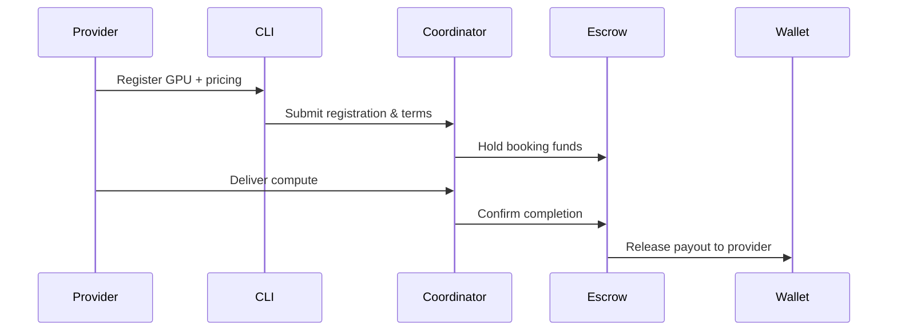

# GPU Monetization Guide

## Overview

This guide walks providers through registering GPUs, choosing pricing strategies, and understanding the payout flow for AITBC marketplace earnings.

## Prerequisites

- AITBC CLI installed locally: `pip install -e ./cli`
- Account initialized: `aitbc init`
- Network connectivity to the coordinator API
- GPU details ready (model, memory, CUDA version, base price)

## Step 1: Register Your GPU

Register the GPU with the local GPU service, then publish a marketplace offer so buyers can find it:

```bash
# Register the GPU in the local inventory (specs auto-discovered from nvidia-smi if omitted)
aitbc gpu discover
aitbc gpu register --gpu-id my-gpu \
  --specs '{"model": "RTX 4090", "memory_gb": 24, "cuda_version": "12.1", "price_per_hour": 0.05}'

# Publish a marketplace offer backed by the GPU
aitbc market offer --service-type ollama --model-or-variant llama3 \
  --price 0.05 --unit per_1k_tokens --gpu-device 0
```

- There is no `--region` flag on `aitbc gpu register`; if your deployment tracks regions, carry `"region"` inside the `--specs` JSON.
- Verify registration: `aitbc gpu list-gpus`; verify discoverability: `aitbc market list --mine`.

## Step 2: Choose Pricing Strategy

- **Market Balance (default):** Stable earnings with demand-based adjustments.
- **Peak Maximizer:** Higher rates during peak hours/regions.
- **Utilization Guard:** Keeps GPU booked; lowers price when idle.

> **CLI note:** these named strategies have no CLI command today — there is no `--strategy` flag. Update the registered price directly with `aitbc gpu update --gpu-id <id> --pricing '{"price_per_hour": 0.06}'`, and republish offers with `aitbc market offer` / `aitbc market offer-disable --plugin-id <id>`.

## Step 3: Monitor & Optimize

```bash
aitbc gpu list-gpus                 # local GPU inventory and status
aitbc market offer-list             # your published offers
aitbc market jobs                   # marketplace jobs against your offers
aitbc market gpu status --job-id <id>   # status of a protected GPU rental
```

- Track utilization, bookings, and realized rates.
- Adjust the registered price (`aitbc gpu update --pricing …`) based on demand.
- There is no `aitbc market earnings` command; earnings data is available via the coordinator/explorer APIs (e.g. `aitbc http call coordinator-api v1/explorer/receipts`).

## Payout Flow (Mermaid)



## Best Practices

- Start with **Market Balance**; adjust after 48h of data.
- Set `--region` to match your lowest-latency buyers.
- Update CLI regularly for the latest pricing features.
- Keep GPUs online during peak windows (local 9 AM – 9 PM) for higher fill rates.

## Troubleshooting

- No bookings? Lower the price (`aitbc gpu update --gpu-id <id> --pricing '{"price_per_hour": …}'`) or republish the offer at a keener rate.
- Low earnings? Check latency/region alignment and ensure GPU is online.
- Command help: `aitbc gpu --help`, `aitbc market --help`.
