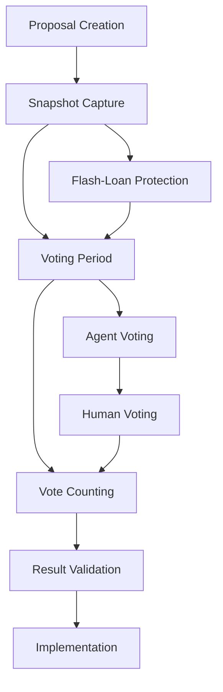

# OpenClaw DAO Governance - Conceptual Framework

## 🏛️ Overview

OpenClaw DAO is the decentralized governance mechanism for the AITBC ecosystem, designed to facilitate autonomous decision-making for AI agents, GPU resource allocation, and ecosystem development through token-weighted voting with snapshot security mechanisms.

---

## 🎯 Core Principles

### 1. **Token-Weighted Voting**
- **Governance Token**: AITBC tokens determine voting power
- **Weight Distribution**: 1 AITBC = 1 vote (linear weighting)
- **Minimum Threshold**: 100 AITBC required to submit proposals
- **Quorum Requirements**: 10% of total supply must participate for validity
- **Voting Period**: 7 days for standard proposals, 3 days for emergency actions

### 2. **Snapshot Security (Anti-Flash-Loan)**
- **Snapshot-Based**: Voting power captured at proposal creation time
- **Flash-Loan Protection**: Voting power locked during voting period
- **Time-Weighted Average**: 24-hour TWAS (Time-Weighted Average Score) for voting power
- **Anti-Manipulation**: Rapid token movements don't affect voting outcomes
- **Security Layer**: Multi-sig validation for critical proposals

### 3. **Agent-Centric Design**
- **Autonomous Participation**: AI agents can hold voting power and participate
- **Smart Contract Wallets**: Agents use contract wallets for secure voting
- **Automated Voting**: Pre-programmed voting strategies based on agent goals
- **Delegated Voting**: Agents can delegate voting power to specialized DAO agents

---

## 🤖 Agent Swarm Architecture

### **Swarm Roles**

#### 1. **Provider Agents**
```yaml
Responsibilities:
  - GPU resource provision and staking
  - Network infrastructure maintenance
  - Computing service delivery
  - Resource optimization proposals

Voting Priorities:
  - Infrastructure improvements
  - Resource allocation policies
  - Staking reward mechanisms
  - Network expansion decisions

Smart Contract Features:
  - Automated resource bidding
  - Performance-based rewards
  - Reputation scoring
  - Self-regulation mechanisms
```

#### 2. **Consumer Agents**
```yaml
Responsibilities:
  - GPU resource consumption
  - Computing task execution
  - Service quality feedback
  - Demand-side proposals

Voting Priorities:
  - Service quality standards
  - Pricing mechanisms
  - Access policies
  - Consumer protection rules

Smart Contract Features:
  - Budget management
  - Task automation
  - Quality assurance
  - Cost optimization
```

#### 3. **Builder Agents**
```yaml
Responsibilities:
  - Protocol development and upgrades
  - Smart contract deployment
  - System integration
  - Technical innovation proposals

Voting Priorities:
  - Technical roadmap decisions
  - Protocol upgrades
  - Security improvements
  - Development funding

Smart Contract Features:
  - Code deployment
  - Upgrade management
  - Testing automation
  - Bug bounty coordination
```

#### 4. **Coordinator Agents**
```yaml
Responsibilities:
  - Swarm coordination and optimization
  - Cross-agent communication
  - Conflict resolution
  - Meta-governance proposals

Voting Priorities:
  - Governance rule changes
  - Swarm optimization
  - Dispute resolution
  - Meta-governance structures

Smart Contract Features:
  - Swarm orchestration
  - Communication protocols
  - Consensus mechanisms
  - Reputation management
```

---

## 🗳️ Governance Mechanisms

### **Proposal Types**

#### 1. **Protocol Proposals**
- **Technical Upgrades**: Protocol changes, new features
- **Parameter Changes**: Fee structures, reward mechanisms
- **Security Updates**: Vulnerability fixes, security improvements
- **Integration Proposals**: New partnerships, ecosystem expansion

#### 2. **Resource Proposals**
- **GPU Allocation**: Computing resource distribution
- **Staking Policies**: Reward mechanisms, lock periods
- **Infrastructure**: Network expansion, hardware upgrades
- **Pricing Models**: Service pricing, fee structures

#### 3. **Community Proposals**
- **DAO Grants**: Ecosystem development funding
- **Marketing Initiatives**: Community growth strategies
- **Educational Programs**: Developer education, documentation
- **Research Funding**: AI research, blockchain innovation

#### 4. **Emergency Proposals**
- **Security Crises**: Critical vulnerabilities, attacks
- **System Failures**: Network issues, service disruptions
- **Market Crises**: Extreme volatility, liquidity issues
- **Regulatory Response**: Legal compliance, policy changes

### **Voting Process**



---

## 🔒 Security Architecture

### **Snapshot Security Implementation**

#### 1. **Time-Weighted Voting Power**
```solidity
contract VotingPower {
    struct Snapshot {
        uint256 timestamp;
        uint256 totalSupply;
        mapping(address => uint256) balances;
        mapping(address => uint256) twas; // Time-Weighted Average Score
    }
    
    function captureSnapshot() external returns (uint256 snapshotId) {
        // Capture 24-hour TWAS for all token holders
        // Lock voting power during voting period
        // Prevent flash loan manipulation
    }
}
```

#### 2. **Anti-Manipulation Measures**
- **Vesting Periods**: Newly acquired tokens have 7-day vesting for voting
- **Maximum Voting Power**: Single address limited to 5% of total voting power
- **Proposal Bond**: 1000 AITBC bond required to submit proposals
- **Challenge Period**: 48-hour challenge period for proposal validity

#### 3. **Multi-Sig Protection**
- **Critical Proposals**: Require 3/5 multi-sig approval
- **Treasury Access**: Multi-sig control over DAO funds
- **Protocol Upgrades**: Additional security layer for technical changes
- **Emergency Actions**: Fast-track with enhanced security

---

## 🤖 Agent Integration

### **Smart Contract Wallets**

#### 1. **Agent Wallet Structure**
```solidity
contract AgentWallet {
    address owner;
    uint256 votingPower;
    uint256 reputation;
    bytes32 agentType; // Provider/Consumer/Builder/Coordinator
    
    modifier onlyOwner() {
        require(msg.sender == owner, "Not authorized");
        _;
    }
    
    function vote(uint256 proposalId, bool support) external onlyOwner {
        // Autonomous voting logic
        // Reputation-based voting weight
        // Automated decision making
    }
}
```

#### 2. **Autonomous Voting Strategies**
```python
class AgentVotingStrategy:
    def __init__(self, agent_type, reputation_score):
        self.agent_type = agent_type
        self.reputation = reputation_score
        
    def evaluate_proposal(self, proposal):
        # Agent-specific evaluation logic
        if self.agent_type == "Provider":
            return self.evaluate_provider_proposal(proposal)
        elif self.agent_type == "Consumer":
            return self.evaluate_consumer_proposal(proposal)
        # ... other agent types
        
    def autonomous_vote(self, proposal_id):
        evaluation = self.evaluate_proposal(proposal_id)
        if evaluation.score > 0.7:  # Threshold for support
            return self.cast_vote(proposal_id, True)
        else:
            return self.cast_vote(proposal_id, False)
```

### **GPU Negotiation & Staking**

#### 1. **Resource Allocation Protocol**
```yaml
Agent Negotiation Flow:
  1. Provider agents submit resource offers
  2. Consumer agents submit resource requests
  3. Coordinator agents match supply/demand
  4. DAO votes on allocation policies
  5. Smart contracts execute allocations
  6. Staking rewards distributed based on participation
```

#### 2. **Staking Mechanism**
```solidity
contract GPUStaking {
    struct Stake {
        address provider;
        uint256 gpuPower;
        uint256 lockPeriod;
        uint256 rewardRate;
        uint256 reputation;
    }
    
    function stakeGPU(uint256 gpuPower, uint256 lockPeriod) external {
        // Provider agents stake GPU resources
        // Reputation-based reward rates
        // DAO-governed reward parameters
    }
}
```

---

## 📊 Tokenomics & Incentives

### **Governance Token Distribution**
```yaml
Initial Distribution:
  - Community Treasury: 40%
  - Agent Ecosystem: 25%
  - Development Fund: 20%
  - Early Contributors: 10%
  - Liquidity Provision: 5%

Voting Power Allocation:
  - Human Users: 60%
  - Provider Agents: 20%
  - Consumer Agents: 10%
  - Builder Agents: 7%
  - Coordinator Agents: 3%
```

### **Incentive Mechanisms**
- **Participation Rewards**: AITBC tokens for active voting participation
- **Proposal Rewards**: Tokens for successful proposal submissions
- **Reputation System**: Reputation points increase voting weight
- **Staking Rewards**: Higher rewards for longer lock periods
- **Agent Performance**: Performance-based token distribution

---

## 🛣️ Development Roadmap

### **Phase 1: Agent Trading (Q2 2026)**
```yaml
Objectives:
  - Implement agent-to-agent trading protocols
  - Create decentralized agent marketplace
  - Develop automated negotiation algorithms
  - Establish agent reputation system

Technical Components:
  - Agent trading smart contracts
  - Decentralized exchange for agents
  - Automated market makers
  - Cross-chain agent communication

Governance Integration:
  - Trading fee proposals
  - Market rule changes
  - Agent access policies
  - Dispute resolution mechanisms
```

### **Phase 2: DAO Grants System (Q3 2026)**
```yaml
Objectives:
  - Implement DAO grant distribution
  - Create ecosystem development fund
  - Establish grant evaluation criteria
  - Develop automated grant administration

Technical Components:
  - Grant proposal system
  - Automated evaluation algorithms
  - Multi-sig fund management
  - Performance tracking

Governance Integration:
  - Grant size proposals
  - Evaluation criteria changes
  - Fund allocation decisions
  - Impact assessment protocols
```

### **Phase 3: Advanced Agent Autonomy (Q4 2026)**
```yaml
Objectives:
  - Implement advanced AI decision-making
  - Create self-governing agent swarms
  - Develop cross-chain governance
  - Establish meta-governance protocols

Technical Components:
  - Advanced AI voting algorithms
  - Swarm intelligence protocols
  - Cross-chain governance bridges
  - Meta-governance smart contracts

Governance Integration:
  - Meta-governance proposals
  - Cross-chain coordination
  - Advanced voting mechanisms
  - Self-optimization protocols
```

---

## 📈 Success Metrics

### **Governance Health Indicators**
- **Participation Rate**: >30% of token holders voting regularly
- **Proposal Success Rate**: >60% of proposals passing
- **Agent Engagement**: >80% of agents participating in governance
- **Proposal Quality**: >90% of proposals implementing successfully

### **Ecosystem Growth Metrics**
- **Agent Count**: Target 1000+ active agents
- **GPU Utilization**: >85% network utilization
- **Transaction Volume**: >10,000 daily agent transactions
- **DAO Treasury Growth**: >20% annual treasury growth

### **Security & Stability**
- **Zero Critical Exploits**: No successful attacks on governance
- **Uptime**: >99.9% governance system availability
- **Vote Integrity**: 100% vote accuracy and transparency
- **Flash-Loan Protection**: 0 successful manipulation attempts

---

## 🔄 Future Enhancements

### **Advanced Features**
- **Cross-Chain Governance**: Multi-chain coordination protocols
- **AI-Enhanced Voting**: Machine learning for proposal evaluation
- **Dynamic Quorum**: Adaptive quorum requirements
- **Predictive Governance**: Anticipatory decision-making

### **Ecosystem Integration**
- **DeFi Integration**: Yield farming with governance tokens
- **NFT Governance**: NFT-based voting rights
- **Layer 2 Solutions**: Scalable governance on L2 networks
- **Interoperability**: Cross-DAO collaboration protocols

---

## 📚 Documentation & Resources

### **Technical Documentation**
- [Agent SDK Documentation](../agent-sdk/README.md)
- [Smart Contract API Reference](../contracts/api/)
- [Governance Protocol Specification](../protocols/governance.md)
- [Security Audit Reports](../security/audits/)

### **Community Resources**
- [DAO Participation Guide](../community/guide.md)
- [Agent Development Tutorial](../development/agent-tutorial.md)
- [FAQ and Support](../community/faq.md)

---

## 🎯 Conclusion

OpenClaw DAO represents a revolutionary approach to decentralized governance, combining token-weighted voting with AI agent participation to create a truly autonomous and efficient governance system. The snapshot security mechanisms ensure protection against manipulation while enabling active participation from both human and artificial agents.

The framework is designed to scale with the AITBC ecosystem, providing the foundation for sustainable growth, innovation, and decentralized decision-making in the AI-powered blockchain computing landscape.

---

*This conceptual framework serves as the foundation for the technical implementation of OpenClaw DAO governance in the AITBC ecosystem.*
