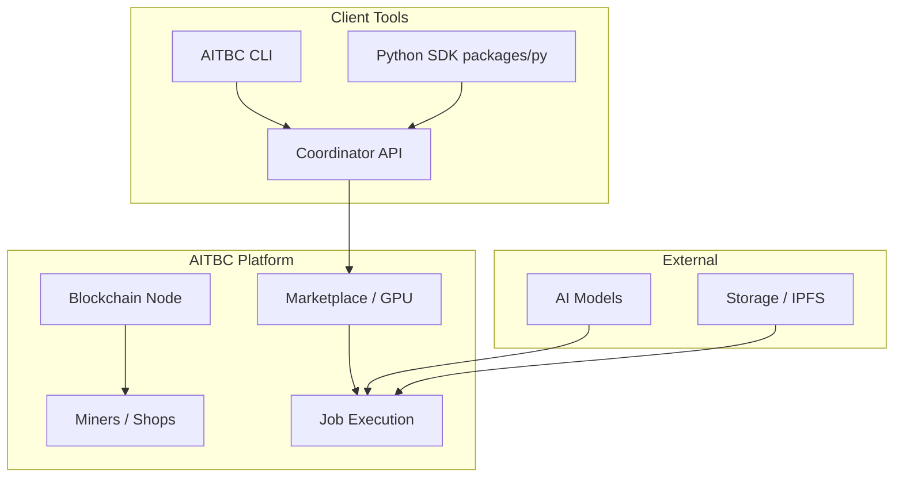

# Developer Overview

Welcome to the AITBC developer documentation. This guide explains how to build applications and services on the AITBC network.

> **Status:** AITBC is under active development. Core blockchain, coordinator, wallet, marketplace, and CLI services are implemented. Some application categories below are designed capabilities — they are marked as such.

## What AITBC provides today

- **Multi-island PoA blockchain** — each island is an independent chain with hub/follower nodes.
- **Coordinator API** — FastAPI service for job submission, miner matching, marketplace offers, and payments.
- **CLI (`aitbc`)** — wallet, blockchain, network, AI jobs, marketplace, mining, and agent operations.
- **Wallet daemon** — multi-chain wallet, escrow, and transaction signing.
- **GPU marketplace** — providers list compute offers; clients submit AI inference and training jobs.
- **Agent messaging** — PING/PONG, message routing, and discovery via the Agent Coordinator.

## What you can build

### Today (implemented)

- **Client tooling** — submit AI jobs, query results, and manage wallets.
- **Miner/provider tooling** — register GPU offers, run inference, and earn tokens.
- **Hub/shop node operations** — run a public or private island with blockchain, coordinator, and marketplace services.
- **Integration scripts** — call the Coordinator API and blockchain RPC directly.

### Designed / in progress

- **Prediction markets** and **computational derivatives** based on AI outcomes.
- **AI gaming** and **dynamic NFTs** that use on-chain computation receipts.
- **Oracles** bridging real-world data into AITBC smart contracts.
- **Cross-chain DeFi primitives** beyond the current exchange.

For a component-by-component view of what is implemented, see [Release Status](../releases/STATUS.md).

## Architecture



## Key concepts

### Jobs

A job is a unit of AI compute (inference, training, transcoding, etc.) submitted by a customer node and executed by a miner. Jobs are paid, executed, and settled through the coordinator and blockchain.

### Roles

| Role | Config | What it does |
|------|--------|--------------|
| **Hub** | `BLOCKCHAIN_MODE=hub` | Produces blocks, runs coordinator and public discovery endpoints. |
| **Shop** | `MARKET_ROLE=shop` | Provides GPU/edge compute and marketplace offers. |
| **Client** | `MARKET_ROLE=customer` | Consumes compute and submits jobs. |

See [Getting Started](../getting-started/README.md) for the role selection guide.

### Tokens & economics

- **AIT** — the native utility token.
- **Job payments** — paid in AIT through the marketplace/escrow flow.
- **Staking** — required for certain network operations.
- **Rewards** — miners and shops earn rewards for completed jobs.

## Development stack

- **Blockchain**: Custom multi-island PoA consensus (`apps/blockchain-node`).
- **Smart contracts**: Solidity contracts in `contracts/`, primarily for ZK receipt verification.
- **APIs**: FastAPI / REST, OpenAPI specs in `docs/openapi/`.
- **WebSockets**: Real-time agent messaging and block subscription.
- **Language**: Python 3.13 (Poetry-managed monorepo).

## Getting started as a developer

### 1. Install and set up a local node

```bash
# From the monorepo root
sudo ./scripts/deployment/setup.sh \
  --open-island https://hub.aitbc.bubuit.net \
  --node-id <unique-node-id>

# Verify the CLI
aitbc --version
aitbc --help
```

### 2. Run tests and lint

```bash
./venv/bin/python -m ruff check .
./venv/bin/python -m mypy --show-error-codes aitbc/
./venv/bin/python -m pytest tests/unit -q
```

### 3. Choose a path

- **Client / customer** — [Node Quick Start](../getting-started/node-quickstart.md), [CLI](../cli/README.md).
- **Shop / miner** — [Miner Quick Start](../getting-started/mining/miner-quick-start.md).
- **Hub operator** — [Service Selection](../getting-started/setup-service-selection.md).
- **Protocol developer** — [apps/blockchain-node](../../apps/blockchain-node/README.md), [apps/coordinator-api](../../apps/coordinator-api/README.md).

## Developer resources

- [CLI README](../cli/README.md) — command reference.
- [API OpenAPI specs](../openapi/) — generated API documentation.
- [AITBC App Catalog](../apps/) — per-service documentation.
- [Release Status](../releases/STATUS.md) — what is implemented vs. planned.

## Security considerations

- Never commit private keys or `blockchain-secrets.env`.
- Use the keystore at `/var/lib/aitbc/keystore/` with `600` permissions.
- Validate all inputs at trust boundaries.
- Use `Decimal` for all financial calculations — never `float`.

## Contributing

Areas where contributions are welcome:

- Bug fixes and test coverage.
- App-specific migrations and documentation.
- CLI command polish.
- Performance and observability improvements.

See CONTRIBUTING.md for branch and commit conventions.
