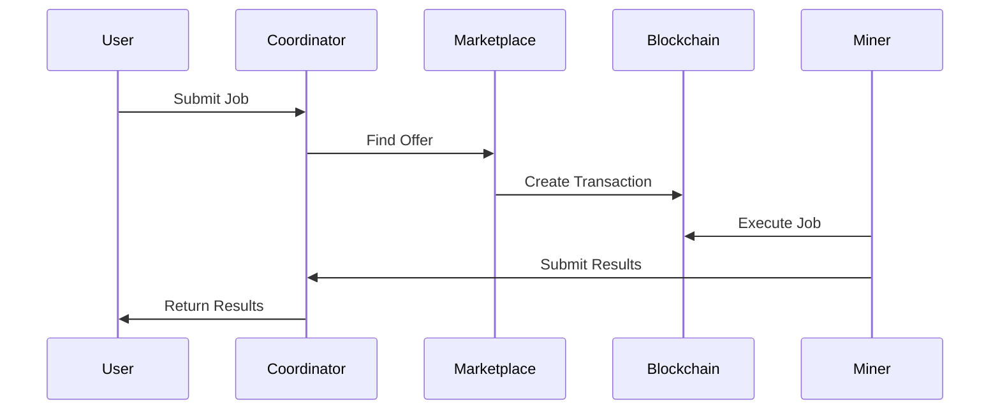

# Architecture

## Overview

AITBC consists of several interconnected components that work together to provide a secure and efficient AI computing platform.

## Components

### Coordinator API
The central service managing jobs, marketplace operations, and coordination.

### Blockchain Nodes
Maintain the distributed ledger and execute smart contracts.

### Wallet Daemon
Manages cryptographic keys and transactions.

### Miners/Validators
Execute AI computations and secure the network.

### Explorer
Browse blockchain data and transactions.

## Data Flow

## Security Model

- Cryptographic proofs for all computations
- Multi-signature validation
- Secure enclave support
- Privacy-preserving techniques
