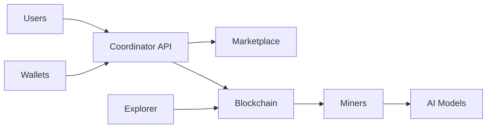

# Introduction to AITBC

AITBC (AI Trusted Blockchain Computing) is a revolutionary platform that combines artificial intelligence with blockchain technology to create a secure, transparent, and efficient ecosystem for AI computations.

## What is AITBC?

AITBC enables:
- **Verifiable AI Computations**: Execute AI workloads on the blockchain with cryptographic proofs
- **Decentralized Marketplace**: Connect AI service providers with consumers in a trustless environment
- **Fair Compensation**: Ensure fair payment for computational resources through smart contracts
- **Privacy Preservation**: Maintain data privacy while enabling verification

## Key Features

### 🔒 Trust & Security
- Cryptographic proofs of computation
- Immutable audit trails
- Secure multi-party computation

### ⚡ Performance
- High-throughput consensus
- GPU-accelerated computations
- Optimized for AI workloads

### 💰 Economics
- Token-based incentives
- Dynamic pricing
- Staking rewards

### 🌐 Accessibility
- Easy-to-use APIs
- SDKs for major languages
- No blockchain expertise required

## Use Cases

### AI Service Providers
- Monetize AI models
- Reach global customers
- Automated payments

### Data Scientists
- Access compute resources
- Verify results
- Collaborate securely

### Enterprises
- Private AI deployments
- Compliance tracking
- Cost optimization

### Developers
- Build AI dApps
- Integrate blockchain
- Create new services

## Architecture

## Getting Started

Ready to dive in? Check out our [Quickstart Guide](quickstart.md) to get up and running in minutes.

## Learn More

- [Architecture Details](architecture.md)
- [Installation Guide](installation.md)
- [Developer Documentation](../developer-guide/)
- [API Reference](../api/)

## Community

Join our community to learn, share, and collaborate:

- [Discord](https://discord.gg/aitbc)
- [GitHub](https://github.com/aitbc)
- [Blog](https://blog.aitbc.io)
- [Twitter](https://twitter.com/aitbc)
