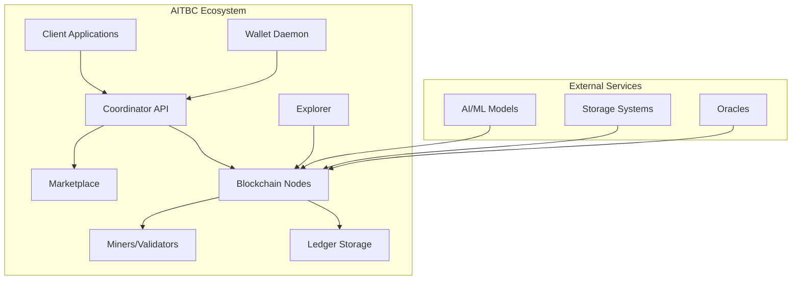

# Welcome to AITBC Documentation

!!! tip "New to AITBC?"
    Start with our [Quickstart Guide](getting-started/quickstart.md) to get up and running in minutes.

AITBC (AI Trusted Blockchain Computing) is a next-generation blockchain platform specifically designed for AI workloads. It provides a secure, scalable, and developer-friendly infrastructure for running AI computations on the blockchain with verifiable proofs.

## 🚀 Key Features

### **AI-Native Design**
- Built from the ground up for AI workloads
- Support for machine learning model execution
- Verifiable computation proofs for AI results
- GPU-accelerated computing capabilities

### **Marketplace Integration**
- Decentralized marketplace for AI services
- Transparent pricing and reputation system
- Smart contract-based job execution
- Automated dispute resolution

### **Developer-Friendly**
- RESTful APIs with OpenAPI specifications
- SDK support for Python and JavaScript
- Comprehensive documentation and examples
- Easy integration with existing AI/ML pipelines

### **Enterprise-Ready**
- High-performance consensus mechanism
- Horizontal scaling capabilities
- Comprehensive monitoring and observability
- Security-hardened infrastructure

## 🏛️ Architecture Overview

## 📚 What's in this Documentation

### For Users
- [Getting Started](getting-started/) - Learn the basics and get running quickly
- [User Guide](../user-guide/) - Comprehensive guide to using AITBC features
- [Tutorials](../developer/tutorials/) - Step-by-step guides for common tasks

### For Developers
- [Developer Guide](../developer/) - Set up your development environment
- [API Reference](../developer/api/) - Detailed API documentation
- [SDKs](../developer/sdks/) - Python and JavaScript SDK guides

### For Operators
- [Operations Guide](../operator/) - Deployment and maintenance
- [Security](../operator/security.md) - Security best practices
- [Monitoring](../operator/monitoring/) - Observability setup

### For Ecosystem Participants
- [Hackathons](../ecosystem/hackathons/) - Join our developer events
- [Grants](../ecosystem/grants/) - Apply for ecosystem funding
- [Certification](../ecosystem/certification/) - Get your solution certified

## 🎯 Quick Links

| Resource | Description | Link |
|----------|-------------|------|
| **Try AITBC** | Interactive demo environment | [Demo Portal](https://demo.aitbc.io) |
| **GitHub** | Source code and contributions | [github.com/aitbc](https://github.com/aitbc) |
| **Discord** | Community support | [Join our Discord](https://discord.gg/aitbc) |
| **Blog** | Latest updates and tutorials | [AITBC Blog](https://blog.aitbc.io) |

## 🆘 Getting Help

!!! question "Need assistance?"
    - 📖 Check our [FAQ](resources/faq.md) for common questions
    - 💬 Join our [Discord community](https://discord.gg/aitbc) for real-time support
    - 🐛 Report issues on [GitHub](https://github.com/aitbc/issues)
    - 📧 Email us at [support@aitbc.io](mailto:support@aitbc.io)

## 🌟 Contributing

We welcome contributions from the community! Whether you're fixing bugs, improving documentation, or proposing new features, we'd love to have you involved.

Check out our [Contributing Guide](developer-guide/contributing.md) to get started.

---

!!! info "Stay Updated"
    Subscribe to our newsletter for the latest updates, releases, and community news.
    
    [Subscribe Now](https://aitbc.io/newsletter)

---

  
Built with ❤️ by the AITBC Team

  
<a href="https://github.com/aitbc/docs/blob/main/LICENSE">License</a> | <a href="https://aitbc.io/privacy">Privacy Policy</a> | <a href="https://aitbc.io/terms">Terms of Service</a>

